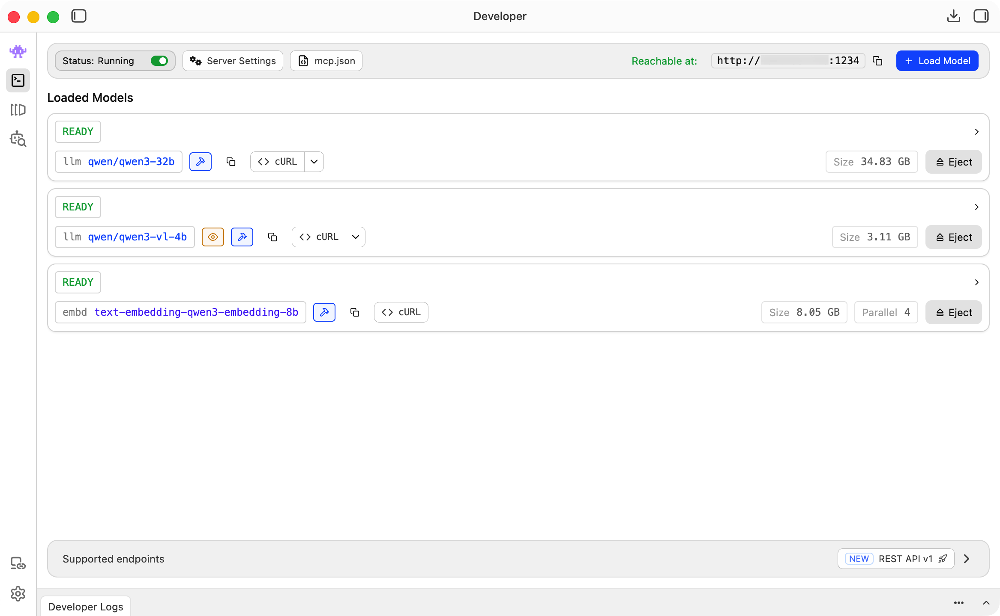
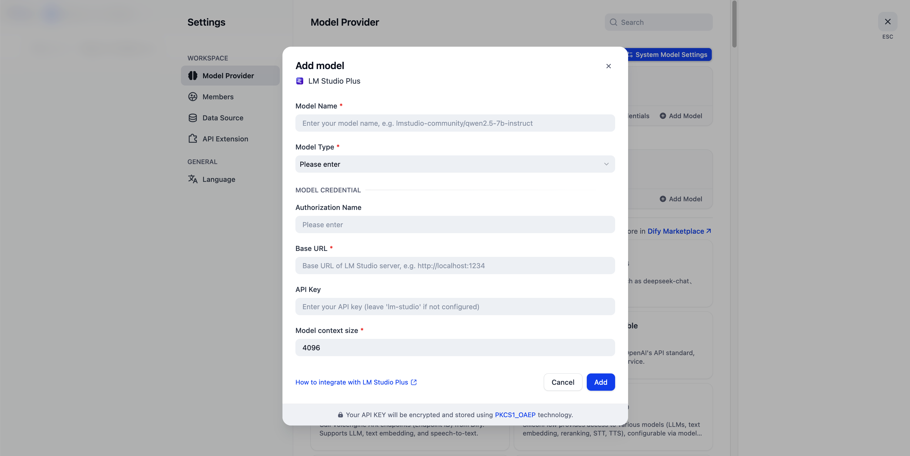

# LM Studio Plus — Dify Plugin

**Author:** [delongdk](https://github.com/delongdk)  
**Version:** 0.0.2
**Type:** model  

Connect your [LM Studio](https://lmstudio.ai/) local models to [Dify](https://dify.ai/).

## Background

The existing [LM Studio plugin](https://github.com/stvlynn/lmstudio-Dify-Plugin) on Dify Marketplace encountered runtime errors and appears to be no longer maintained. 
**LM Studio Plus** provides an alternative that runs smoothly and supports more configuration options.

## Features

- **LLM (Chat & Completion)** — both modes route through OpenAI-compatible `/v1/chat/completions`
- **Text Embedding** — via `/v1/embeddings`
- **Streaming** — real-time token streaming with SSE
- **Reasoning / Thinking** — streams `reasoning_content` with `<think>` tag wrapping
- **Tool Calling** — OpenAI function calling format with streaming tool call aggregation
- **Vision** — multi-modal image input support (configurable per model)
- **Structured Output** — generic JSON mode and JSON Schema constraints; schema auto-injected into system prompt
- **API Key Authentication** — optional API key support for secured LM Studio server access
- **Customizable Parameters** — temperature, top_p, top_k, max_tokens, presence_penalty, frequency_penalty, repeat_penalty, seed

## Requirements

- [LM Studio](https://lmstudio.ai/) running with model loaded
- API server mode enabled in LM Studio (default port: `1234`)

## Setup

### 1. LM Studio

1. Install and open [LM Studio](https://lmstudio.ai/)
2. Load a local model (e.g. `lmstudio-community/qwen2.5-7b-instruct`)
3. Start the local server (Developer → Start Server)

### 2. Install Plugin

Install **LM Studio Plus** from Dify Marketplace, or install manually from source.

### 3. Add Model

1. Go to **Settings → Model Provider → LM Studio Plus → Add Model**

2. Fill in:
   - **Model Name** — the identifier shown in LM Studio (e.g. `qwen/qwen3-32b`)
   - **Base URL** — your LM Studio server address (default: `http://localhost:1234`)
   - **Completion Mode** — `Chat` (multi-turn) or `Completion` (single prompt)
   - **Context Size** / **Max Tokens** — adjust based on your model
   - **Vision Support** / **Function Call Support** — enable if your model supports them

## Usage

After setup, select any configured LM Studio model from the model dropdown in your Dify applications — Chatbot, Agent, Workflow, etc.

## License

[MIT](LICENSE)

